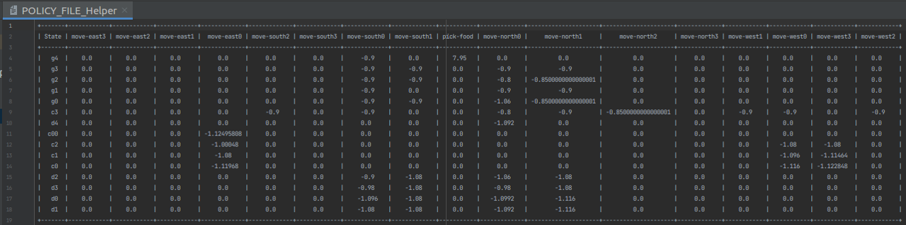
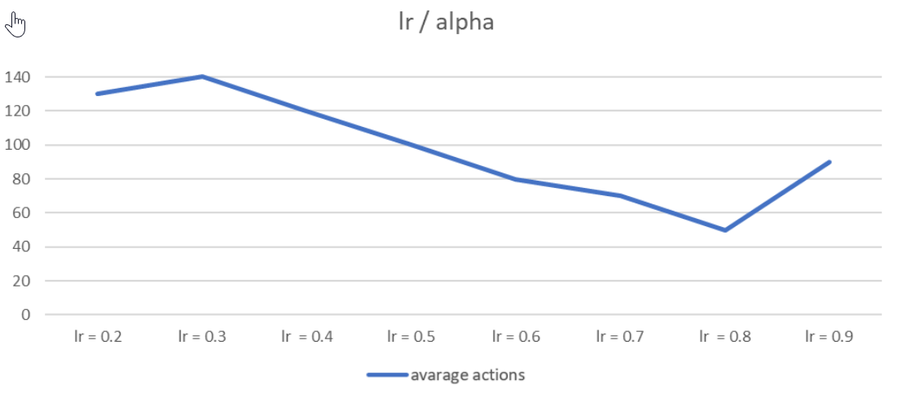
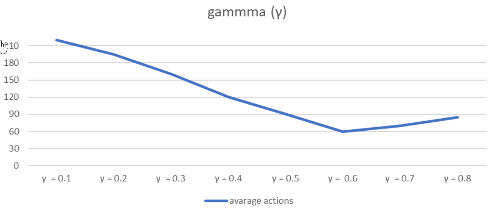

# Q-Learning-Agent

Consists of 2 agents:

### QLearningExecutor
The agent who creates and learns the policy. The result of the agent's run is saved into the policy file. Example of the policy file:
<h1 align="center">
  
</h1>

The update process is done using the Bellman equation:
Q(s,a) := (1 - alpha) * Q(s,a) + alpha * [R(s,a) + gamma * max Q(s',a')]

### LearnedPolicyExecutor
The agent that uses the policy file that the learner agent has learned. Does not change or update it - only uses it.

### Hyper parameters

<h1 align="center">
  
</h1>

<h1 align="center">
  
</h1>
